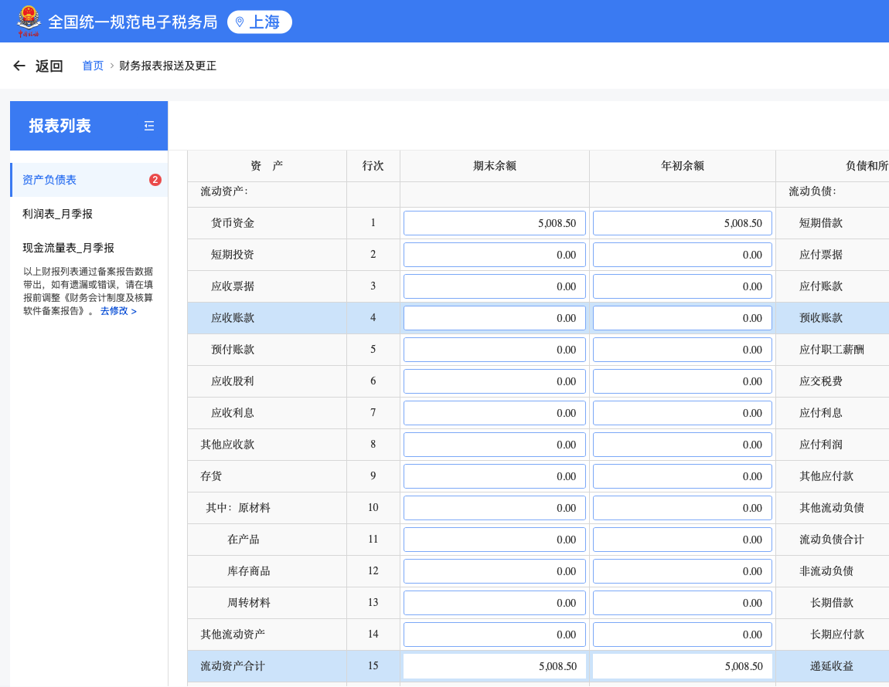
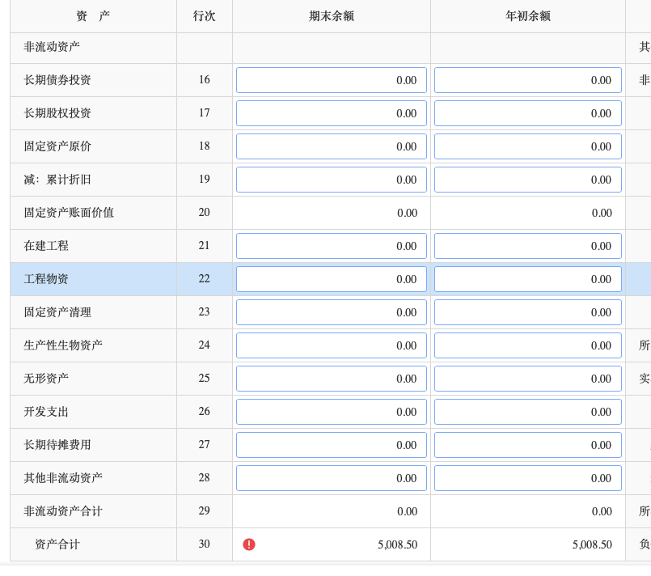
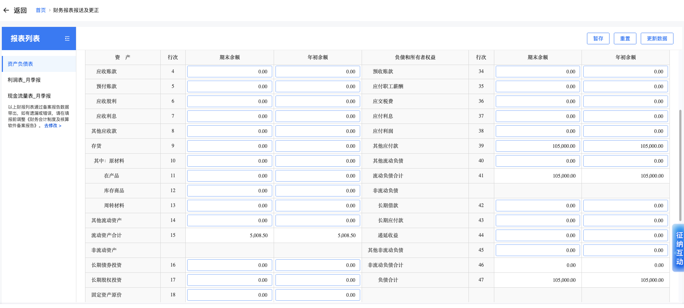
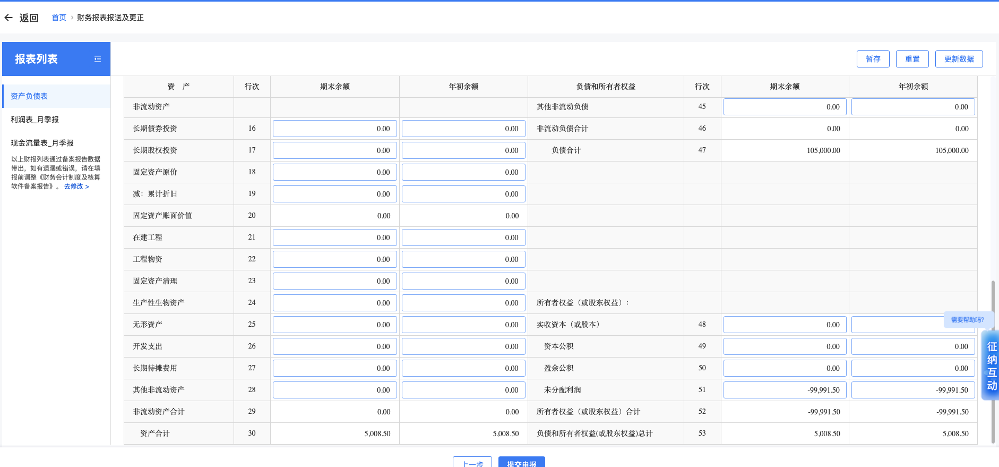

# 公司报税

### 员工个税申报

1. 首页-综合所得申报-正常工资薪金所得-申报表报送

### 企业季报填写

1. [全国电子税务局](https://etax.shanghai.chinatax.gov.cn:8443)登录

2. 财务报表报送（季报）

    * 1.货币资金 和 15.流动资产合计  5,008.50

        

    * 30.资产合计  5,008.50

        

    * 39.其他应付款  41.流动负债合计  47.负债合计 105,000.00

        

    * 51.未分配利润-99,991.50

        

3. 增值税及附加税费申报

4. 居民企业（查账征收）企业所得税月（季度申报）
