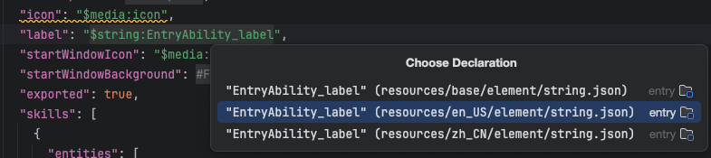
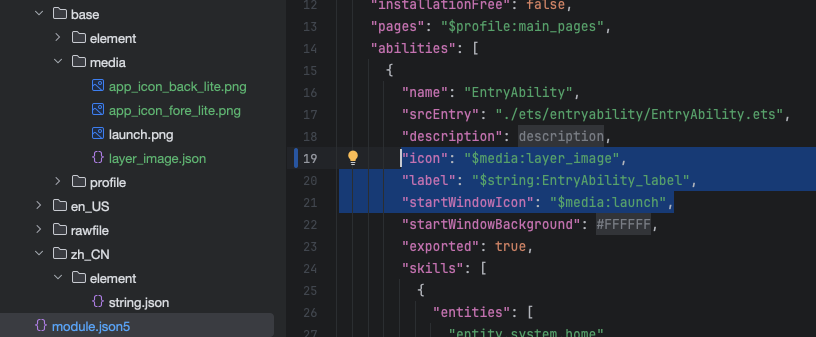

### 1. 修改 Bundle ID

- 修改 `ohos/AppScope/app.json` 文件中的 `bundleName` 为 `com.ideal.flyerteacafes.hm`

### 2. 修改应用名称 (AppName)

鸿蒙应用的名称是在模块的配置文件中定义的。通常位于项目级的 `AppScope` 或具体模块的 `module.json5` 中。

文件路径：`ohos/AppScope/resources/base/element/string.json`

```json
{
  "string": [
    {
      "name": "app_name",
      "value": "你的新应用名称"
    }
  ]
}
```

- `src/main/module.json5` 中的 `label`，对应的 `value` 值修改为你的 `appName`



### 3. 修改图标

- 添加 `src/main/resources/base/media/layered_image.json`

```json
{
  "layered-image": {
    "background": "$media:app_icon_back_lite",
    "foreground": "$media:app_icon_fore_lite"
  }
}
```

- 添加对应的前景图片和背景图片和启动屏图片
- 修改 `src/main/module.json5` 中的 `icon`，对应的 `value` 值修改为你的 `icon`



### 4. 优化flutter启动时候有一段时间的白屏问题

- 修改`ohos/entry/src/main/ets/pages/Index.ets`

```ets

import common from '@ohos.app.ability.common';
import { FlutterPage } from '@ohos/flutter_ohos'

let storage = LocalStorage.getShared()
const EVENT_BACK_PRESS = 'EVENT_BACK_PRESS'

@Entry(storage)
@Component
struct Index {
  private context = getContext(this) as common.UIAbilityContext
  @LocalStorageLink('viewId') viewId: string = "";
  @State showSplash: boolean = true;

  aboutToAppear(): void {
    setTimeout(() => {
      this.showSplash = false;
    }, 2000)
  }

  build() {
    Stack() {
      FlutterPage({ viewId: this.viewId })

      if (this.showSplash) {
        Image($r('app.media.launch'))
          .width('100%')
          .height('100%')
          .objectFit(ImageFit.Cover)
      }
    }
  }

  onBackPress(): boolean {
    this.context.eventHub.emit(EVENT_BACK_PRESS)
    return true
  }
}
```
