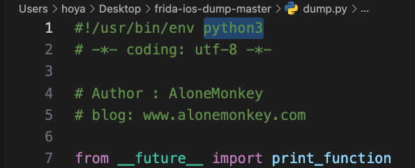
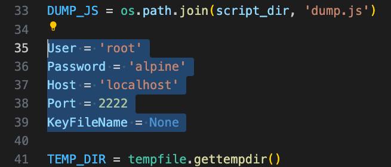

# Frida 砸壳

1. 安装 [frida-ios-dump](https://github.com/AloneMonkey/frida-ios-dump)

    ```sh
    # 下载官方及配置
    sudo git clone https://github.com/AloneMonkey/frida-ios-dump
    ```

2. 电脑配置 Frida，Python 版本需要 3.0+

    ```sh
    # 安装frida及配置等
    pip install frida
    pip install frida-tools
    # 安装依赖等
    sudo pip install -r requirements.txt --upgrade
    ```

3. 手机配置 Frida，打开 cydia，添加源： **<https://build.frida.re/>** 添加之后安装 Frida 插件

4. 手机电脑都安装成功之后 在电脑的终端可以通过下面命令验证一下 查看所有的 App

    ```sh
    frida-ps -U
    ```

5. 通过 USB 连接电脑 参考 [SSH连接手机](./ssh-connection.md)

    ```sh
    # 安装依赖插件
    brew install usbmuxd
    
    # 映射端口
    iproxy 2222 22
    
    # 切换为另一个终端执行
    ssh -p 2222 root@localhost
    ```

6. 进入到步骤 2 执行完成的代码仓库中，选择 app 执行砸壳，砸过后的 ipa 就会被导出到当前文件夹下

    ```sh
    # 跳转到具体的你电脑上的路径
    cd $path/frida-ios-dump
    
    # 执行砸壳
    ./dump.py app名称或者Bundle identifier
    ```

    执行砸壳前先确认当前 **python** 版本 如果是 3.0+ 的话 需要修改 dump.py 文件中的第一行为 **python3**

    

    并且确定是否手机的 **User、Password、Host、Port** 是否正确

    

    其他命令

    ```sh
    # 获取手机所有启动的应用
    frida-ps -U -a 
    
    # 获取手机所有安装的应用
    dump.py -l 
    
    # 对xxx应用砸壳
    dump.py xxx 
    ```

### 参考资料

[Frida官网](https://frida.re)

[越狱砸壳工具 frida-ios-dump 使用小记](https://zhuanlan.zhihu.com/p/35873543)

[iOS逆向安防从入门到秃头--砸壳&Frida](https://juejin.cn/post/6966504711935655950)
