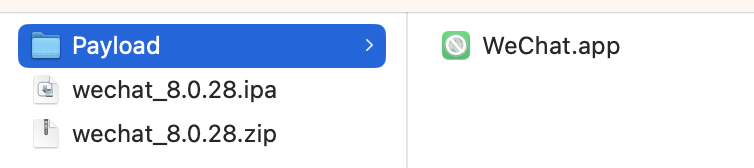
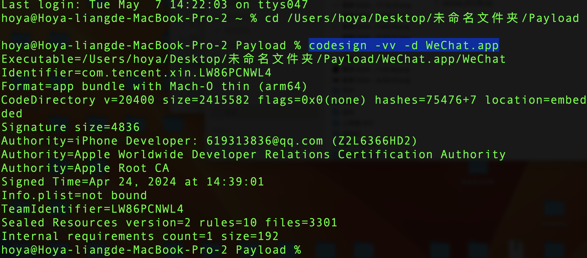
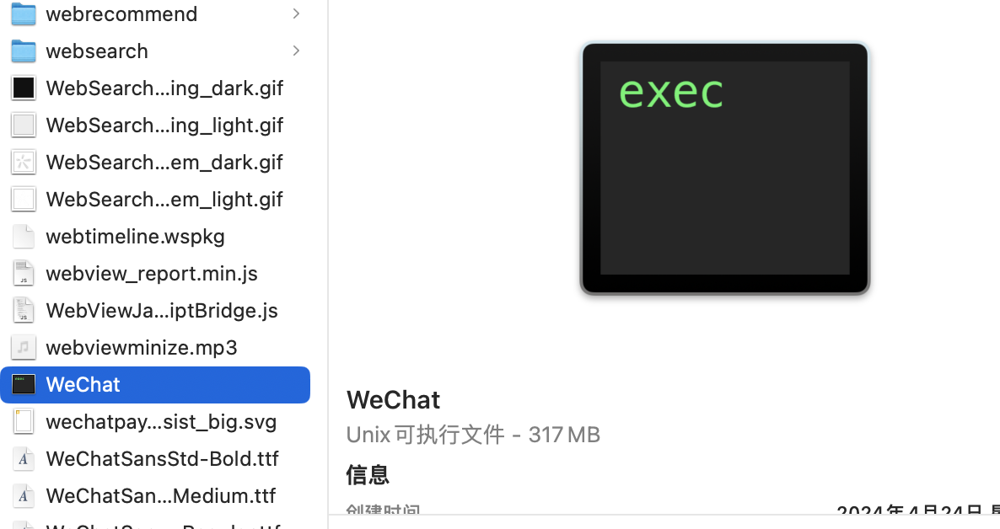
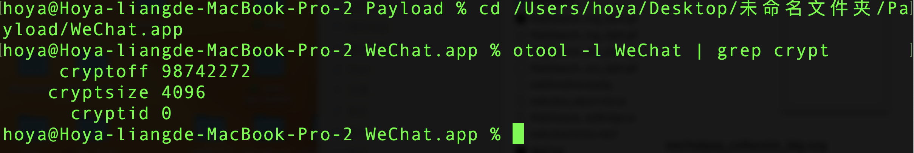

# iPA重签名

iOS 重签名是通过将 AppStore 的签名替换为 **开发环境（embedded.mobileprovision）签名** 的形式，使得 ipa 可以安装在手机上的操作。

### 一、方法步骤

1. 网上获取砸壳的 ipa 文件或者自己砸壳，如果自己砸壳的 **微信** 需要删除 `PlugIns` 和 `Watch` 文件夹，不然会安装失败

2. 通过 [iOS app signer](https://github.com/DanTheMan827/ios-app-signer) 签名 ([fork版本防止丢失](https://gitee.com/white_lhy/fork-ios-app-signer))；证书使用 Development 证书

3. 通过 **Xcode-Devices and Simulators** 或者 **iTools** 工具等安装到手机

### 二、技术相关

1. 通过 **codesign** 查看当前 ipa 的签名证书

    1. 将 ipa 包重命名为 **zip** 解压缩之后得到 **Paylod** 文件夹

        

    2. 使用命令查看 app 文件的签名信息

        ```sh
        codesign -vv -d WeChat.app
        ```

        

2. 查看 ipa 是否加壳，只有砸过壳的包才可以重签名

    拿到 app 文件后，通过显示包内容找到对应的一个 unix 可执行 **MachO** 文件；通过 **otool** 查看是否加密；如果

    ```sh
    # 输出cryptid为0代表已经砸壳，即解密，为1或者2表示以第1类或者第2类加密方案加密。
    otool -l WeChat | grep crypt
    ```

    

    

### 三、实例及参考资料

1. [微信插件Github抢红包等DKWechatHelper](https://github.com/DKJone/DKWechatHelper/) [fork版本防丢](https://gitee.com/white_lhy/fork-dkwechat-helper)
2. [iOS证书签名机制&重签名&防止重签名](https://juejin.cn/post/6844904013159202824)
3. [应用签名原理和重签名实操](https://www.jianshu.com/p/0e825a653593)
4. [iOS逆向之从砸壳到重签名](https://juejin.cn/post/7031815461360631816)
