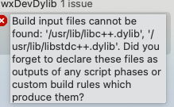
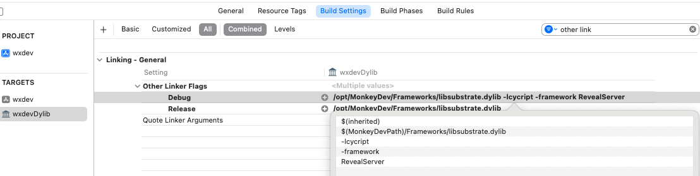
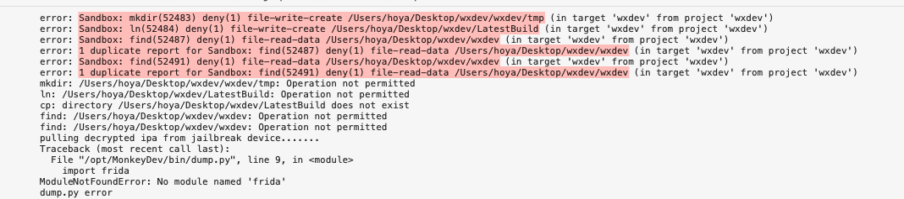
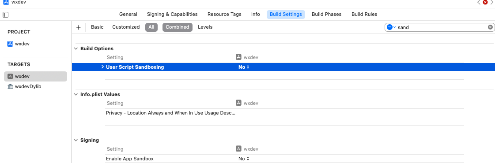

# MonkeyApp 开发

1. 根据 [MonkeyDevWiki](https://github.com/AloneMonkey/MonkeyDev/wiki) 教程安装到电脑。如果某天仓库消失，请使用 [备用仓库]() 进行手动安装

    * 安装最新的 [theos](https://github.com/theos/theos/wiki/Installation)

        ```sh
        sudo git clone --recursive https://github.com/theos/theos.git /opt/theos
        ```

    * 安装 ldid (如安装 theos 过程安装了 ldid，跳过)

        ```sh
        brew install ldid
        ```

    * 配置免密码登录越狱设备 (如果没有越狱设备，跳过)

        ```sh
        ssh-keygen -t rsa -P ''
        ssh-copy-id -i /Users/username/.ssh/id_rsa root@ip
        ```

        或者安装 sshpass 自己设置密码:

        ```sh
        brew install https://raw.githubusercontent.com/kadwanev/bigboybrew/master/Library/Formula/sshpass.rb
        ```

    * 你可以通过以下命令选择指定的 Xcode 进行安装:

        ```sh
        sudo xcode-select -s /Applications/Xcode-beta.app
        ```

        默认安装的 Xcode 为:

        ```sh
        xcode-select -p
        ```

    * 执行安装命令:

        ```sh
        sudo /bin/sh -c "$(curl -fsSL https://raw.githubusercontent.com/AloneMonkey/MonkeyDev/master/bin/md-install)"
        ```

    * 卸载

        ```sh
        sudo /bin/sh -c "$(curl -fsSL https://raw.githubusercontent.com/AloneMonkey/MonkeyDev/master/bin/md-uninstall)"
        ```

    * 更新

        ```sh
        sudo /bin/sh -c "$(curl -fsSL https://raw.githubusercontent.com/AloneMonkey/MonkeyDev/master/bin/md-update)"
        ```

2. 报错问题解决

    * `libc++.dylib` 等库无法找到 是因为老版本 `fishhook` 需要对应的动态库支持，更新最新的 `fishhook` 然后删除对应项就可以了 [参考方案](https://github.com/AloneMonkey/MonkeyDev/issues/349)

        

        下载最新 [fishhook](https://github.com/facebook/fishhook) [fork备用](https://gitee.com/white_lhy/fishhook) 替换 `/opt/MonkeyDev/templates/MonkeyAppLibrary.xctemplate/fishhook/` 文件夹下的 `fishhook.c`、`fishhook.h` 下次新建模版就是最新版的 `fishhook` 了

        然后在新项目中修改动态库的 `Build Setting` `-` `Other Linker Flags`

        

    * `SandBox` 编译报错 [参考](https://github.com/AloneMonkey/MonkeyDev/issues/350)

        

        修改项目的 `Build Setting` `-` `User Script Sandboxing` 为 `NO`

        
